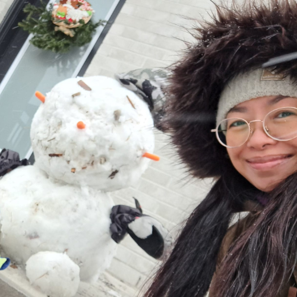
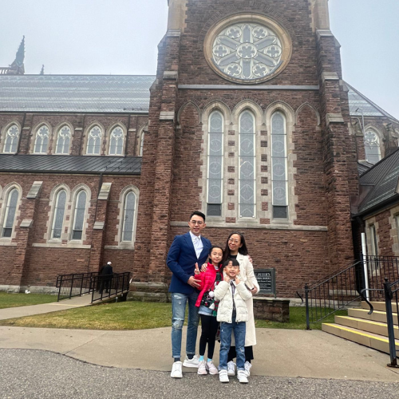
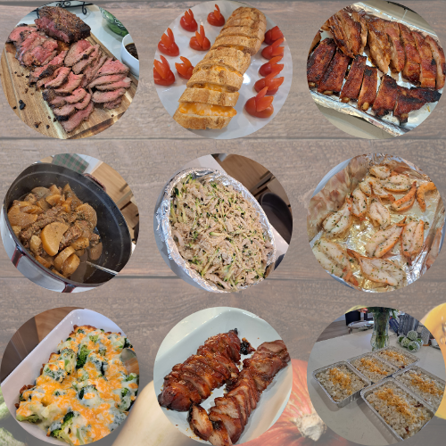
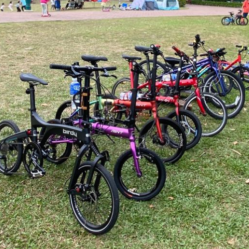
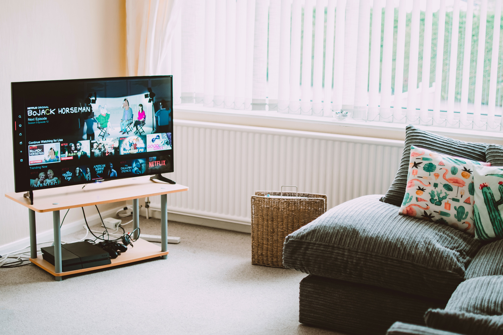
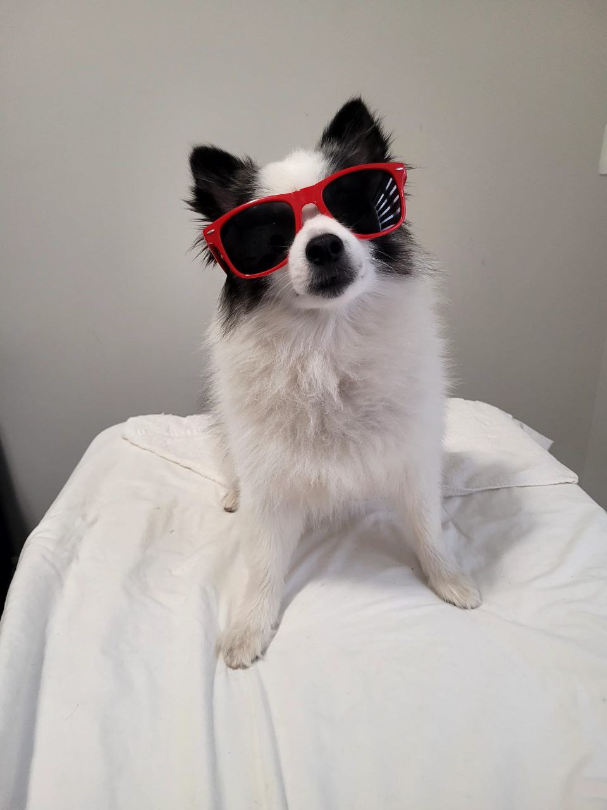

# Amazing TWO_Tbenipal_KingYinSham

<i> We come from different parts of the world and form a duo here, so let's introduce ourselves! </i>

## ***Sham King Yin, Connie***

## ***About me***
- My name is Sham King Yin, you can call me Connie. I’m come from Hong Kong. I’m married and have two children, one aged 9 daughter and one aged 6 son. They are very lovely and always make me happy.

### *My Kids - Hannah & Elvis*

### *Our family is Catholic*

### *My Hobbies*
### 1. Cooking
- #### Delicious Food

### 2. Reading
- #### My Favorite Book 
 

- [Give me a hug](https://youtu.be/KWnIjxzZ4MU)
*<-- Listen Story Telling by Hannah (^3^)*

### 3. Cycling

>

## ***Tapshveer benipal***

### **About Me:**
*Hi, my name is Tapshveer Benipal I don't have a preferred name so you can call me Tapsh or anything you wish like calling me. I'm from a different city which is much more populated so I'm not use to silence. I am a very introvert person & I might also be the youngest in class. I also have a pet dog his name is Rocky he is 4 years old & he is a Pomsky with hazel eyes.*

### **My Hobbies:**
### 1. Playing Soccer

### 2. Going to the Gym

### 3. Watching TV

### 4. Playing Video Games

### 5. Playing with my dog

