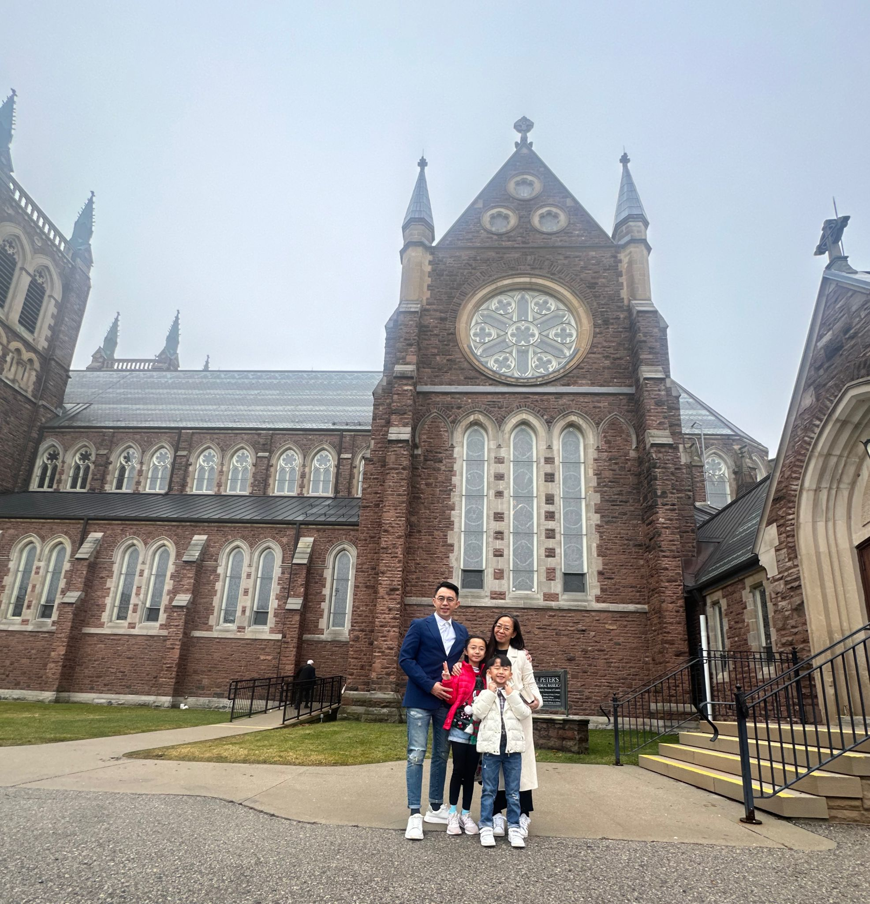

# Amazing TWO_Tbenipal_KingYinSham

<i> We come from different parts of the world and form a duo here, so let's introduce ourselves! </i>

## ***Sham King Yin, Connie***

## **About me**
- My name is Sham King Yin, you can call me Connie. I’m come from Hong Kong. I’m married and have two children, one aged 9 daughter and one aged 6 son. They are very lovely and always make me happy.

<u>

### My Kids - Hannah & Elvis </U>

<u>

### Our family is Catholic </u>

<u>

<u>

### My Hobbies </u>
### 1. Cooking
- #### Delicious Food

### 2. Reading
- #### My Favorite Book 
 

- [Give me a hug](https://youtu.be/KWnIjxzZ4MU)
*<-- Listen Story Telling by Hannah (^3^)*

### 3. Cycling

>

### ***Tapshveer benipal***

**About Me:**
1. I'm a very introvert person
2. I'm very helpful & friendly
3. I'm also very good in Technology

**My Hobbies:**

- Playing Soccer 
- Going to the Gym
- Watching TV
- Playing Video Games
- Playing with my dog

**My dogs name is Rocky he is 4 years old & he is a Pomsky with hazel eyes**
